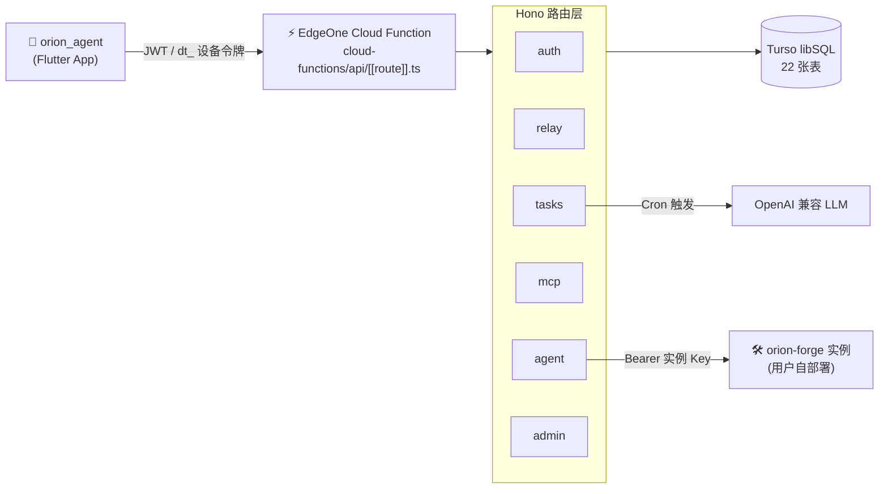

<div align="center">

# ☁️ orion_agent_cloud

**Orion Agent 的云端后端 —— 账号 · 授权 · 中继 · 定时任务 · Agent 中继**

运行在腾讯云 **EdgeOne Pages** 边缘函数上，数据库使用 **Turso**（libSQL 托管）。
无服务器 · 免运维 · 免费额度起步。

[](https://www.typescriptlang.org)
[](https://edgeone.cloud.tencent.com/pages)
[](https://turso.tech)
[](#-本地开发)
[](https://hono.dev)

</div>

> **设计原则**：[orion_agent](https://github.com/suanx/orion_agent) 端上保持本地优先、可完全离线；
> 云端只负责单机做不到的事。未登录/未激活只是云功能置灰，**本地功能不做云端锁死**。

---

## 📑 目录

- [架构](#-架构)
- [功能一览](#-功能一览)
- [部署教程](#-部署教程edgeone-pages--turso)
- [本地开发](#-本地开发)
- [安全设计](#-安全设计)
- [相关仓库](#-相关仓库)

---

## 🏗️ 架构



- **App 永远拿不到实例地址与密钥**：Agent 中继在后端持密钥转发
- 端上 AES-GCM 加密后上传，服务端只存密文（零知识云备份）

---

## 📡 功能一览

| 模块 | 端点 | 说明 |
|---|---|---|
| 账号 | `POST /api/auth/register` `login` `refresh` `logout` | JWT(2h) + Refresh Token(30d，一次性轮换+复用检测) |
| 设备 | `GET/DELETE /api/auth/devices` | 设备列表/解绑；套餐设备数上限（free=1 / trial=2 / pro=3） |
| 设备令牌 | `POST /api/auth/device-token` | 长期令牌(`dt_`)，供 orion 的 MCP 配置使用 |
| 账号授权 | `GET /api/license/status` | 管理台直接为账号设置套餐（free/trial/pro/lifetime）；到期自动降级 free。卡密已下线 |
| **管理台 Web UI** | `GET /api/admin` | 磨砂液态玻璃单页管理台：仪表盘 / 账号授权 / 用户封禁 / Agent 实例授权 / 公告管理 / 用量 / 审计日志，5 套配色主题 + 明暗模式，浏览器打开即用（ADMIN_TOKEN 登录） |
| 管理 API | `/api/admin/*` | 管理台背后的接口：账号授权、用户封禁、Agent 实例授权、公告管理、用量与审计 |
| **Agent 中继** | `POST /api/agent/chat` | 中继 App 对话请求到用户自部署的 orion-forge 实例：后端持密钥、AI SDK 事件流转 OpenAI 兼容 SSE、周配额独立计数（`agent_run`）、会话映射续上下文 |
| **Agent 产物代理** | `GET /api/agent/files` `/file` `POST/DELETE /dev-server` | 转发沙箱文件树 / 文件内容 / dev server 预览，App 不接触实例地址 |
| 搜索中继 | `GET /api/relay/search?q=` | DuckDuckGo(免Key) / Serper / 博查 三后端可切换 |
| 抓取中继 | `GET /api/relay/fetch?url=` | SSRF 防护 + 2MB 上限 + 正文抽取 |
| 云端任务 | `/api/tasks` CRUD + `GET /tasks/results?after=` | Cron 到期由服务端调 LLM 执行，App 打开拉取补跑 |
| Cron 入口 | `POST /api/tasks/run-due` | 管理员令牌，接 EdgeOne Cron Trigger |
| MCP 服务 | `POST /api/mcp` | JSON-RPC 2.0：cloud_search / cloud_fetch / cloud_schedule_task / cloud_list_tasks |
| 更新分发 | `GET /api/update/check` | 版本清单 + 强更/普通更新可选（`UPDATE_FORCE_UPDATE`）+ APK 地址 |
| 弹窗公告 | `GET /api/announcement` | 当前启用的公告（支持版本范围），管理台发布/编辑/停用 |
| 健康检查 | `GET /api/health` | 鉴权 + 数据库全链路验证 |

**套餐配额**（每日，UTC+8）：free 搜索/抓取 20 次、云端任务 1 个；trial 100 次 / 5 个；
pro 与 lifetime 500 次 / 20 个。可用 `PLAN_LIMITS_OVERRIDE` 环境变量覆盖（JSON）。

**账号授权规则**（管理台「账号授权」页直接设置）：

- 模式「设置」：从当前时间起算；「顺延」：在现有到期时间上叠加
- lifetime 覆盖一切（永久）；更高套餐未过期时授权低级套餐，保留高套餐到期时间再顺延
- 到期自动降级 free；free = 撤销授权

---

## 🚀 部署教程（EdgeOne Pages + Turso）

> 📘 **完整版**（含 App 构建、Agent 平台部署、后台配置、运维手册、FAQ）：
> **[docs/DEPLOYMENT.md](docs/DEPLOYMENT.md)**。下面是速查版，全程约 15 分钟。

### 第 1 步 · 创建 Turso 数据库

1. 注册/登录 [app.turso.tech](https://app.turso.tech)（GitHub 账号即可）
2. 创建数据库，取名 `orion`，区域选离你最近的（如 `hkg` / `sin`）
3. 拿到 **数据库 URL** 与 **Auth Token**：
   ```bash
   turso db tokens create orion
   ```

### 第 2 步 · 建表（22 条 DDL）

```bash
git clone https://github.com/suanx/orion_agent_cloud.git
cd orion_agent_cloud
npm install

TURSO_DATABASE_URL=libsql://orion-你的组织.turso.io \
TURSO_AUTH_TOKEN=你的token \
npm run db:migrate
```

成功会输出 `完成: 22 条 DDL 已应用` 并列出全部表名。脚本是幂等的，重复执行安全。

### 第 3 步 · 部署到 EdgeOne Pages

1. [EdgeOne 控制台](https://console.cloud.tencent.com/edgeone) → **Pages** → **创建项目** → 连接 Git 仓库
2. 构建配置：
   - 框架预设：**None**
   - 安装命令：`npm install`
   - 构建命令：`npm run typecheck`
   - 输出目录：`dist`（纯函数项目，留空亦可）
   - `cloud-functions/` 目录会被识别为 **Cloud Functions（Node.js runtime）**，
     所有 `/api/*` 请求由 `cloud-functions/api/[[route]].ts` 接管。
     `edgeone.json` 里的 `cloudFunctions.nodejs.maxDuration` **只对这个目录生效**——
     旧版的 `functions/` 目录跑 Edge Runtime（V8，CPU 200ms、不支持 maxDuration），
     长流式转发会被腰斩，详见下方「运行时选型」。

   **运行时选型（2026-10-10 修正）**：本项目必须用 `cloud-functions/`（Node.js v20）。
   云端 Agent 中继是长挂的流式 SSE 转发（单次任务挂几分钟），Edge Runtime 的
   CPU 200ms 配额与无 `maxDuration` 支持扛不住；历史上误放在 `functions/` 目录，
   导致 `maxDuration: 120` 配置从未生效、App 侧表现为「网络波动，重连 4 次全失败」。
3. **配置环境变量**（完整清单见 `.env.example`）：

   | 变量 | 必填 | 说明 |
   |---|---|---|
   | `TURSO_DATABASE_URL` | ✅ | 第 1 步的 libsql:// URL |
   | `TURSO_AUTH_TOKEN` | ✅ | 第 1 步的 token |
   | `JWT_SECRET` | ✅ | `openssl rand -hex 32` 生成 |
   | `ADMIN_TOKEN` | ✅ | 管理台令牌，长随机串 |
   | `PUBLIC_BASE_URL` | 建议 | 站点自身地址（如 `https://orion.suen.us.ci`）。未配置时后端会从请求自动推导，但显式配置更稳 |
   | `SEARCH_PROVIDER` | 可选 | `duckduckgo`(默认) / `serper` / `bocha` |
   | `SERPER_API_KEY` / `BOCHA_API_KEY` | 可选 | 对应搜索后端的 Key |
   | `CLOUD_LLM_BASE_URL` 等 3 项 | 可选 | 云端定时任务用的 OpenAI 兼容端点 |
   | `UPDATE_LATEST_VERSION` 等 4 项 | 可选 | 应用内检查更新（`UPDATE_FORCE_UPDATE=true` 强更） |
   | `PLAN_LIMITS_OVERRIDE` | 可选 | JSON，覆盖套餐配额 |
   | `REGISTER_EMAIL_DOMAINS` | 可选 | 注册邮箱域名白名单，逗号分隔；留空用默认 `qq.com,189.cn,139.com,163.com,126.com` |

4. 部署完成后得到 `https://xxx.edgeone.app` 形式域名（可绑定自定义域）

### 第 4 步 · 验证部署

```bash
# 版本清单（无需鉴权）
curl "https://xxx.edgeone.app/api/update/check?platform=android&current=0.1.9"

# 注册测试账号
curl -X POST https://xxx.edgeone.app/api/auth/register \
  -H "content-type: application/json" \
  -d '{"email":"a@b.c","password":"abc12345","deviceId":"phone-1"}'
```

### 第 5 步 · 配置 Cron Trigger（云端定时任务）

EdgeOne 控制台 → Pages 项目 → **边缘函数** → **定时触发**：

- 触发地址：`POST https://xxx.edgeone.app/api/tasks/run-due`
- 请求头：`Authorization: Bearer <ADMIN_TOKEN>`
- 周期：每 5–15 分钟一次即可（任务粒度是「每天 HH:MM」）

### 第 6 步 · orion_agent 端接入

- **MCP**：「我的 → MCP 服务器」→ 添加 `orion-cloud` → `https://xxx.edgeone.app/api/mcp`
  （或在 App 内登录后调 `POST /api/auth/device-token` 换取 `dt_` 设备令牌）
- **搜索/抓取中继**：模型工具配置将端点指向 `/api/relay/search` / `/api/relay/fetch`
  （携带 `Authorization: Bearer <JWT 或 dt_ 令牌>`）
- **云端 Agent**：App 登录后顶栏切「云端 Agent」；实例由管理员在管理台逐账号授权

---

## 💻 本地开发

```bash
npm install

# 用本地 SQLite 文件即可跑通全流程（无需 Turso）
TURSO_DATABASE_URL=file:./local.db node scripts/migrate.mjs

TURSO_DATABASE_URL=file:./local.db \
JWT_SECRET=dev-secret-0123456789abcdef0123456789abcdef \
ADMIN_TOKEN=dev-admin \
npx tsx scripts/dev.mjs        # http://127.0.0.1:8787

npm test        # vitest 单元测试
npm run typecheck
```

---

## 🔐 安全设计

- 密码 **PBKDF2-SHA256**（12 万次迭代 + 随机盐），WebCrypto 实现，边缘运行时可用
- Access / Refresh / Device 三种令牌分离；Refresh 一次性轮换；仅存 SHA-256 哈希
- 卡密/授权原子更新（`WHERE status='unused'` 条件更新防并发）；敏感操作写 `audit_log`
- **SSRF 防护**：中继拦截内网/环回/元数据地址；响应体 ≤ 2MB
- 配额 UPSERT 原子自增；云功能由服务端强制校验，**本地功能不做云端锁死**
- Turso authToken 只存边缘函数环境变量；App 端只见 JWT / 设备令牌
- Agent 实例 API Key 后端 AES-GCM 加密存储，App 全程不可见

---

## 📦 相关仓库

| 仓库 | 说明 |
|---|---|
| [orion_agent](https://github.com/suanx/orion_agent) | Android 端（Flutter），本地优先 AI 助手 |
| [orion-forge](https://github.com/suanx/open-agents) | 云端 Agent 平台（Next.js + Vercel Sandbox） |

---

## 📄 许可

仅供个人学习与使用，与 orion_agent 主项目一致。
